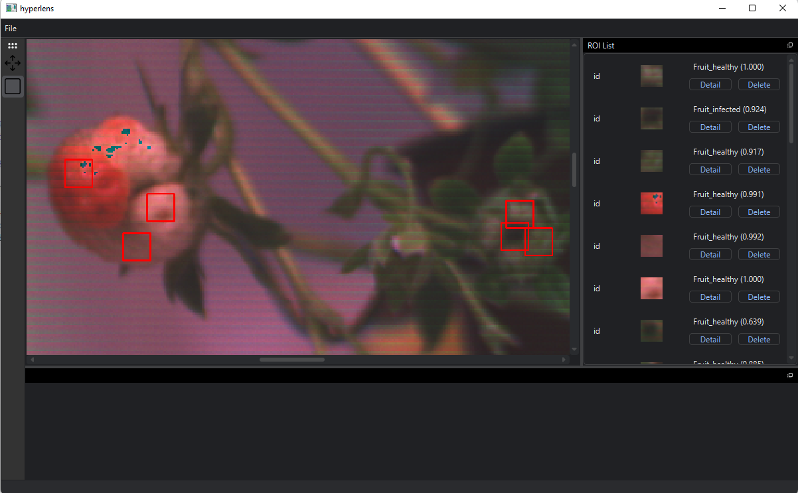

# HyperLens

> Hyperspectral AI Model Viewer by KIST smartfarm
>
> contact: redtiger@kist.re.kr



## Installation 

install miniconda or anaconda to set python virtual environment. 

create conda environment and activate it. 
```bash
conda create -n hyperlens python=3.10 
conda activate
```

move in this repository, install python dependencies
```bash
cd hyperlens
pip install -r requirements.txt 
``` 

Run pylense

```
python hyperlense/__main__.py 
```


